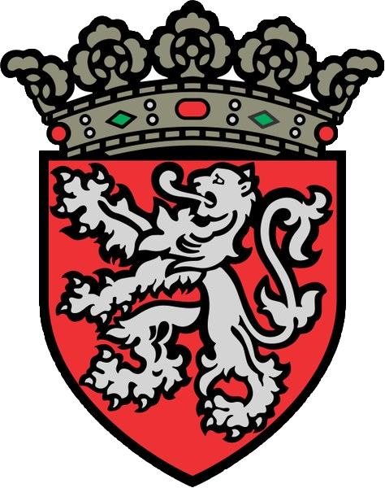

<!-- PROJECT LOGO -->
 

  

<h3 align="center">Boot'Antoing</h3>

  

    project_description
  

<!-- TABLE OF CONTENTS -->

  
Table of Contents

  <ol>
    <li>
      <a href="#about-the-project">About The Project</a>
      <ul>
        <li><a href="#built-with">Built With</a></li>
      </ul>
    </li>
    <li><a href="#contact">Contact</a></li>
    <li><a href="#acknowledgments">Acknowledgments</a></li>
  </ol>

<!-- ABOUT THE PROJECT -->
## About The Project

Boot'Antoing was made during a [Citizens of Wallonia](https://www.citizensofwallonia.be/) hackaton. 

(<a href="#top">back to top</a>)

### Built With

* love

(<a href="#top">back to top</a>)

<!-- CONTACT -->
## Contact

Project repository [link](https://github.com/JeanChristopheM/wallonia)

Angélique Paquot - [github]() - [linkedin]() - [discord](https://discordapp.com/users/Angélique Paquot#8024)

Corentine - [github]() - [linkedin]() - [discord](https://discordapp.com/users/Corentine#1141)

Eva Mélinand - [github]() - [linkedin]() - [discord](https://discordapp.com/users/Eva Mélinand#6043)

Jean-Christophe - [github]() - [linkedin]() - [discord](https://discordapp.com/users/JeanCM#7711)

Loïc Rouaud - [github]() - [linkedin]() - [discord](https://discordapp.com/users/Loïc Rouaud#4341)

Lucas Ielli - [github]() - [linkedin]() - [discord](https://discordapp.com/users/Lucas Ielli#8302)

Stéphanie Antignac - [github](https://github.com/StephanieAn) - [linkedin](www.linkedin.com/in/stéphanie-antignac) - [discord](https://discordapp.com/users/Stephanie A#5160)

Zoé Ranzy - [github](https://github.com/hawkstan) - [linkedin](https://www.linkedin.com/in/z-m-ranzy/) - [discord](https://discordapp.com/users/nfr#7235/)

(<a href="#top">back to top</a>)

<!-- ACKNOWLEDGMENTS -->
## Acknowledgments

* [Citizens of Wallonia](https://www.citizensofwallonia.be/)
* [BeCode](https://becode.org/)

(<a href="#top">back to top</a>)

